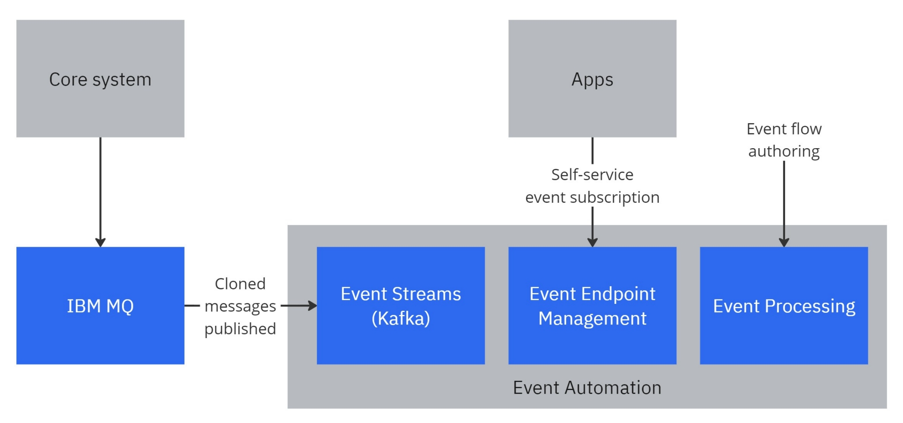
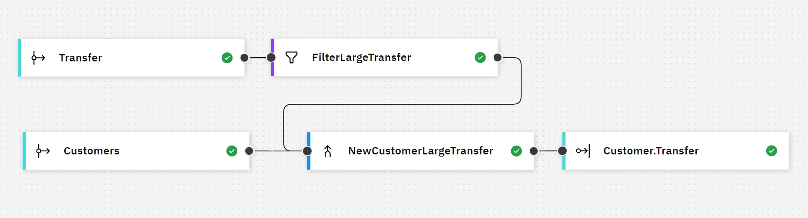

# Event Streams DemoApp
Welcome to Event Automation DemoApp.

This DemoApp demonstrates how IBM Event Automation capability to generate a new business insight by processing and combining two or more different events (topics) in a real-time.

## Demo scenario

**Business requirement:**

How to get notification to trigger another system (e.g. Promotion) if a new customer get registered and do certain transaction (e.g. transfer money with amount equal or bigger than IDR 10 million) within 24 hours?

**Solution:**

Using IBM Event Automation we can solve this requirement easily by creating an event flow (using low-code/no-code tool) to process two different events/topics (e.g. CUSTOMER registration and TRANSFER events) simultaneously and real-time: make a filter for checking the conditions and generate a new event if the conditions are met (see Event Processing Flow picture below).

## Architecture diagram

**Note:**
This demo takes message from IBM MQ as a source (which is originally produced by core system), clone and forward it to IBM Event Automation (Event Streams, Event Endpoint Management and Event Processing) for further processing. 

## Event Processing Flow

**Note:**
Two different events (Transfer and Customers) that might come from different systems get processed by IBM Event Processing: filtering and combining in real-time within certain time window. If the condition meets the requirements then it generates a new event (e.g. Customer.Transfer) as a business insight to trigger other system.

## How to develop the demo
1. Prepare OpenShift cluster
2. Install CP4I:
   - Setup IBM Entitlement Key
   - Clone this repo: https://github.com/ronikurnia1/EventStreamApp
   - In CP4I terminal run './deploy.sh'
4. On OpenShift cluster, create application unsing this GitHub repo: https://github.com/ronikurnia1/EventStreamApp 

## How to use the DemoApp
1. Navigate to Message page by clicking Message on left-side navigation menu.
2. On this page imagine there are two different system producing messages and send them to queues. You can generate random data for both CUSTOMER and TRANSFER by clicking Get random data button but do not send the message yet! By clicking Send message button it will send the message to the IBM MQ and forward it to Event Streams for further processing (as you can see on the above diagram)
3. Navigate to Subscription page by clicking Subscription on left-side navigation menu and it will open new browser tab.
4. On this page you can subscribe to different events/topics (TRANSFER, CUSTOMER, TRANSFER >=1m and CUSTOMER.TRANSFER >= 10m) to see if any data coming in on that particular event/topic. To subscribe to that events/topics click Subscribe button on right side of each event/topic. And click Unsubscribe button (the same button) to stop it. You can also subscribe to all events/topics.
5. Once you have subscribed to all events/topics, go back to Message page (on the previous browser tab) and start sending some messages both CUSTOMER and TRANSFER and you can see some message coming in on Subscription page.
6. To simulate the scenario as per business requirement above, do the following steps:
   - On Message page, generate random data for CUSTOMER and TRANSFER.
   - Copy 'AccountNo' value from CUSTOMER data and replace 'Source' value on TRANSFER data with it, so AccountNo and Source have the same value.
   - Update the 'Amount' value on TRANSFER data and make sure it is equal or bigger than 10000000 (1 million)
   - Send the CUSTOMER data first and then TRANSFER data after it by clicking Send message button on both of them.
   - Go to Subscription page and you should see your data appears on CUSTOMER.TRANSFER >= 10m topic.

